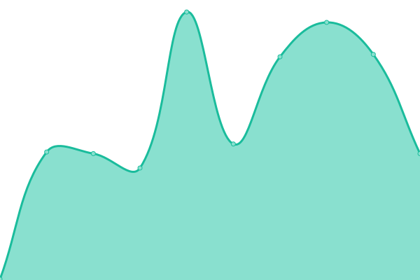

# [📈 Live Status](https://status.twomey.tech): <!--live status--> **🟧 Partial outage**

This repository contains the open-source uptime monitor and status page for [nate1579](https://status.twomey.tech), powered by [Upptime](https://github.com/upptime/upptime).

With [Upptime](https://upptime.js.org), you can get your own unlimited and free uptime monitor and status page, powered entirely by a GitHub repository. We use [Issues](https://github.com/nate1579/uptime-monitor/issues) as incident reports, [Actions](https://github.com/nate1579/uptime-monitor/actions) as uptime monitors, and [Pages](https://status.twomey.tech) for the status page.

<!--start: status pages-->
<!-- This summary is generated by Upptime (https://github.com/upptime/upptime) -->
<!-- Do not edit this manually, your changes will be overwritten -->
<!-- prettier-ignore -->
| URL | Status | History | Response Time | Uptime |
| --- | ------ | ------- | ------------- | ------ |
|  [Twomey PC](https://twomeypcrepair.com) | 🟥 Down | [twomey-pc.yml](https://github.com/nate1579/uptime-monitor/commits/HEAD/history/twomey-pc.yml) | 

 167ms
     
 | 

<a href="https://status.twomey.tech/history/twomey-pc">100.00%</a>
    

|  [Twomey Services](https://twomeyservices.com) | 🟩 Up | [twomey-services.yml](https://github.com/nate1579/uptime-monitor/commits/HEAD/history/twomey-services.yml) | 

 187ms
     
 | 

<a href="https://status.twomey.tech/history/twomey-services">100.00%</a>
    

|  [Twomey PC Website Services](https://twomeypcwebsiteservices.com) | 🟩 Up | [twomey-pc-website-services.yml](https://github.com/nate1579/uptime-monitor/commits/HEAD/history/twomey-pc-website-services.yml) | 

 194ms
     
 | 

<a href="https://status.twomey.tech/history/twomey-pc-website-services">100.00%</a>
    

|  [Twomey Tracker](https://twomeytracker.com) | 🟩 Up | [twomey-tracker.yml](https://github.com/nate1579/uptime-monitor/commits/HEAD/history/twomey-tracker.yml) | 

 268ms
     
 | 

<a href="https://status.twomey.tech/history/twomey-tracker">100.00%</a>
    

|  [Arkansas Computer](https://arkansas.computer) | 🟩 Up | [arkansas-computer.yml](https://github.com/nate1579/uptime-monitor/commits/HEAD/history/arkansas-computer.yml) | 

 427ms
     
 | 

<a href="https://status.twomey.tech/history/arkansas-computer">100.00%</a>
    

|  [2ME Pythons](https://2mepythons.com) | 🟩 Up | [2-me-pythons.yml](https://github.com/nate1579/uptime-monitor/commits/HEAD/history/2-me-pythons.yml) | 

 149ms
     
 | 

<a href="https://status.twomey.tech/history/2-me-pythons">100.00%</a>
    

|  [Arkansas Marijuana Doctor](https://arkansasmarijuana.doctor) | 🟩 Up | [arkansas-marijuana-doctor.yml](https://github.com/nate1579/uptime-monitor/commits/HEAD/history/arkansas-marijuana-doctor.yml) | 

 499ms
     
 | 

<a href="https://status.twomey.tech/history/arkansas-marijuana-doctor">100.00%</a>
    

|  [Arkansas Termite](https://arkansastermite.com) | 🟩 Up | [arkansas-termite.yml](https://github.com/nate1579/uptime-monitor/commits/HEAD/history/arkansas-termite.yml) | 

 201ms
     
 | 

<a href="https://status.twomey.tech/history/arkansas-termite">100.00%</a>
    

|  [AZ Industries](https://azind.com) | 🟩 Up | [az-industries.yml](https://github.com/nate1579/uptime-monitor/commits/HEAD/history/az-industries.yml) | 

 156ms
     
 | 

<a href="https://status.twomey.tech/history/az-industries">100.00%</a>
    

|  [CHHCA](https://chhca.com) | 🟥 Down | [chhca.yml](https://github.com/nate1579/uptime-monitor/commits/HEAD/history/chhca.yml) | 

 0ms
     
 | 

<a href="https://status.twomey.tech/history/chhca">100.00%</a>
    

|  [Comfort Keepers Ministry](https://comfortkeepersministry.org) | 🟩 Up | [comfort-keepers-ministry.yml](https://github.com/nate1579/uptime-monitor/commits/HEAD/history/comfort-keepers-ministry.yml) | 

 465ms
     
 | 

<a href="https://status.twomey.tech/history/comfort-keepers-ministry">100.00%</a>
    

|  [Crimson Tech Review](https://crimsontechreview.com) | 🟥 Down | [crimson-tech-review.yml](https://github.com/nate1579/uptime-monitor/commits/HEAD/history/crimson-tech-review.yml) | 

 0ms
     
 | 

<a href="https://status.twomey.tech/history/crimson-tech-review">100.00%</a>
    

|  [Crystal Healing Hands](https://crystalhealinghands.com) | 🟩 Up | [crystal-healing-hands.yml](https://github.com/nate1579/uptime-monitor/commits/HEAD/history/crystal-healing-hands.yml) | 

 176ms
     
 | 

<a href="https://status.twomey.tech/history/crystal-healing-hands">100.00%</a>
    

|  [CVSID](https://cvsid.org) | 🟩 Up | [cvsid.yml](https://github.com/nate1579/uptime-monitor/commits/HEAD/history/cvsid.yml) | 

 751ms
     
 | 

<a href="https://status.twomey.tech/history/cvsid">100.00%</a>
    

|  [Dannys Auto Body](https://dannysautobody.net) | 🟩 Up | [dannys-auto-body.yml](https://github.com/nate1579/uptime-monitor/commits/HEAD/history/dannys-auto-body.yml) | 

 403ms
     
 | 

<a href="https://status.twomey.tech/history/dannys-auto-body">100.00%</a>
    

|  [EXP School Higher Edu](https://expschoolhigheredu.com) | 🟩 Up | [exp-school-higher-edu.yml](https://github.com/nate1579/uptime-monitor/commits/HEAD/history/exp-school-higher-edu.yml) | 

 343ms
     
 | 

<a href="https://status.twomey.tech/history/exp-school-higher-edu">100.00%</a>
    

|  [FOD Buster](https://fodbuster.com) | 🟩 Up | [fod-buster.yml](https://github.com/nate1579/uptime-monitor/commits/HEAD/history/fod-buster.yml) | 

 167ms
     
 | 

<a href="https://status.twomey.tech/history/fod-buster">100.00%</a>
    

|  [FOD Master](https://fodmaster.com) | 🟩 Up | [fod-master.yml](https://github.com/nate1579/uptime-monitor/commits/HEAD/history/fod-master.yml) | 

 358ms
     
 | 

<a href="https://status.twomey.tech/history/fod-master">100.00%</a>
    

|  [For Every Dog Rescue](https://foreverydogrescueinc.org) | 🟩 Up | [for-every-dog-rescue.yml](https://github.com/nate1579/uptime-monitor/commits/HEAD/history/for-every-dog-rescue.yml) | 

 831ms
     
 | 

<a href="https://status.twomey.tech/history/for-every-dog-rescue">100.00%</a>
    

|  [Hey Maui](https://heymaui.com) | 🟩 Up | [hey-maui.yml](https://github.com/nate1579/uptime-monitor/commits/HEAD/history/hey-maui.yml) | 

 601ms
     
 | 

<a href="https://status.twomey.tech/history/hey-maui">100.00%</a>
    

|  [Highland Square Shopping](https://highlandsquareshopping.com) | 🟩 Up | [highland-square-shopping.yml](https://github.com/nate1579/uptime-monitor/commits/HEAD/history/highland-square-shopping.yml) | 

 405ms
     
 | 

<a href="https://status.twomey.tech/history/highland-square-shopping">100.00%</a>
    

|  [Highland Twin Cinema](https://highlandtwincinema.com) | 🟩 Up | [highland-twin-cinema.yml](https://github.com/nate1579/uptime-monitor/commits/HEAD/history/highland-twin-cinema.yml) | 

 907ms
     
 | 

<a href="https://status.twomey.tech/history/highland-twin-cinema">100.00%</a>
    

|  [Lazer Graphics Plus](https://lazergraphicsplus.com) | 🟥 Down | [lazer-graphics-plus.yml](https://github.com/nate1579/uptime-monitor/commits/HEAD/history/lazer-graphics-plus.yml) | 

 0ms
     
 | 

<a href="https://status.twomey.tech/history/lazer-graphics-plus">100.00%</a>
    

|  [Maui Paradise Vacations](https://mauiparadisevacations.com) | 🟩 Up | [maui-paradise-vacations.yml](https://github.com/nate1579/uptime-monitor/commits/HEAD/history/maui-paradise-vacations.yml) | 

 236ms
     
 | 

<a href="https://status.twomey.tech/history/maui-paradise-vacations">100.00%</a>
    

|  [Nancy Steinbeck](https://nancysteinbeck.com) | 🟩 Up | [nancy-steinbeck.yml](https://github.com/nate1579/uptime-monitor/commits/HEAD/history/nancy-steinbeck.yml) | 

 433ms
     
 | 

<a href="https://status.twomey.tech/history/nancy-steinbeck">100.00%</a>
    

|  [Ninja Bids](https://ninjabids.com) | 🟩 Up | [ninja-bids.yml](https://github.com/nate1579/uptime-monitor/commits/HEAD/history/ninja-bids.yml) | 

 286ms
     
 | 

<a href="https://status.twomey.tech/history/ninja-bids">100.00%</a>
    

|  [Ozark Quick Grill](https://ozarkquickgrill.com) | 🟥 Down | [ozark-quick-grill.yml](https://github.com/nate1579/uptime-monitor/commits/HEAD/history/ozark-quick-grill.yml) | 

 0ms
     
 | 

<a href="https://status.twomey.tech/history/ozark-quick-grill">100.00%</a>
    

|  [Patricia Clary](https://patriciaclary.com) | 🟩 Up | [patricia-clary.yml](https://github.com/nate1579/uptime-monitor/commits/HEAD/history/patricia-clary.yml) | 

 977ms
     
 | 

<a href="https://status.twomey.tech/history/patricia-clary">100.00%</a>
    

|  [Pest and Termite Solutions](https://pestandtermitesolutions.com) | 🟩 Up | [pest-and-termite-solutions.yml](https://github.com/nate1579/uptime-monitor/commits/HEAD/history/pest-and-termite-solutions.yml) | 

 419ms
     
 | 

<a href="https://status.twomey.tech/history/pest-and-termite-solutions">100.00%</a>
    

|  [Rock Sweeper](https://rocksweeper.com) | 🟩 Up | [rock-sweeper.yml](https://github.com/nate1579/uptime-monitor/commits/HEAD/history/rock-sweeper.yml) | 

 342ms
     
 | 

<a href="https://status.twomey.tech/history/rock-sweeper">100.00%</a>
    

|  [Scheel Family Practice](https://scheelfamilypractice.com) | 🟩 Up | [scheel-family-practice.yml](https://github.com/nate1579/uptime-monitor/commits/HEAD/history/scheel-family-practice.yml) | 

 172ms
     
 | 

<a href="https://status.twomey.tech/history/scheel-family-practice">100.00%</a>
    

|  [South Fork Health and Wellness](https://southforkhealthandwellness.com) | 🟩 Up | [south-fork-health-and-wellness.yml](https://github.com/nate1579/uptime-monitor/commits/HEAD/history/south-fork-health-and-wellness.yml) | 

 188ms
     
 | 

<a href="https://status.twomey.tech/history/south-fork-health-and-wellness">100.00%</a>
    

|  [Spring River Drones](https://springriverdrones.com) | 🟩 Up | [spring-river-drones.yml](https://github.com/nate1579/uptime-monitor/commits/HEAD/history/spring-river-drones.yml) | 

 204ms
     
 | 

<a href="https://status.twomey.tech/history/spring-river-drones">100.00%</a>
    

|  [Spring River Health Wellness](https://springriverhealthwellness.com) | 🟩 Up | [spring-river-health-wellness.yml](https://github.com/nate1579/uptime-monitor/commits/HEAD/history/spring-river-health-wellness.yml) | 

 163ms
     
 | 

<a href="https://status.twomey.tech/history/spring-river-health-wellness">100.00%</a>
    

|  [Spring River Law](https://springriverlaw.com) | 🟩 Up | [spring-river-law.yml](https://github.com/nate1579/uptime-monitor/commits/HEAD/history/spring-river-law.yml) | 

 186ms
     
 | 

<a href="https://status.twomey.tech/history/spring-river-law">100.00%</a>
    

|  [SRACC](https://sracc.org) | 🟩 Up | [sracc.yml](https://github.com/nate1579/uptime-monitor/commits/HEAD/history/sracc.yml) | 

 283ms
     
 | 

<a href="https://status.twomey.tech/history/sracc">100.00%</a>
    

|  [The Gun Magnet](https://thegunmagnet.com) | 🟩 Up | [the-gun-magnet.yml](https://github.com/nate1579/uptime-monitor/commits/HEAD/history/the-gun-magnet.yml) | 

 161ms
     
 | 

<a href="https://status.twomey.tech/history/the-gun-magnet">100.00%</a>
    

|  [The Mag Mount](https://themagmount.com) | 🟩 Up | [the-mag-mount.yml](https://github.com/nate1579/uptime-monitor/commits/HEAD/history/the-mag-mount.yml) | 

 346ms
     
 | 

<a href="https://status.twomey.tech/history/the-mag-mount">100.00%</a>
    

|  [The Pistol Mag](https://thepistolmag.com) | 🟩 Up | [the-pistol-mag.yml](https://github.com/nate1579/uptime-monitor/commits/HEAD/history/the-pistol-mag.yml) | 

 369ms
     
 | 

<a href="https://status.twomey.tech/history/the-pistol-mag">100.00%</a>
    

|  [The Pistol Magnet](https://thepistolmagnet.com) | 🟩 Up | [the-pistol-magnet.yml](https://github.com/nate1579/uptime-monitor/commits/HEAD/history/the-pistol-magnet.yml) | 

 351ms
     
 | 

<a href="https://status.twomey.tech/history/the-pistol-magnet">100.00%</a>
    

|  [The Rose Trellis](https://therosetrellis.com) | 🟩 Up | [the-rose-trellis.yml](https://github.com/nate1579/uptime-monitor/commits/HEAD/history/the-rose-trellis.yml) | 

 190ms
     
 | 

<a href="https://status.twomey.tech/history/the-rose-trellis">99.86%</a>
    

|  [Therapy Works Inc](https://therapyworksinc.com) | 🟩 Up | [therapy-works-inc.yml](https://github.com/nate1579/uptime-monitor/commits/HEAD/history/therapy-works-inc.yml) | 

 390ms
     
 | 

<a href="https://status.twomey.tech/history/therapy-works-inc">100.00%</a>
    

|  [Tripler Bail Bonds](https://triplerbailbonds.com) | 🟩 Up | [tripler-bail-bonds.yml](https://github.com/nate1579/uptime-monitor/commits/HEAD/history/tripler-bail-bonds.yml) | 

 311ms
     
 | 

<a href="https://status.twomey.tech/history/tripler-bail-bonds">100.00%</a>
    

|  [Tripler Pawn](https://triplerpawn.com) | 🟩 Up | [tripler-pawn.yml](https://github.com/nate1579/uptime-monitor/commits/HEAD/history/tripler-pawn.yml) | 

 394ms
     
 | 

<a href="https://status.twomey.tech/history/tripler-pawn">100.00%</a>
    

|  [Tripolion](https://tripolion.com) | 🟩 Up | [tripolion.yml](https://github.com/nate1579/uptime-monitor/commits/HEAD/history/tripolion.yml) | 

 367ms
     
 | 

<a href="https://status.twomey.tech/history/tripolion">100.00%</a>
    

|  [Vape Vault Salem](https://vapevaultsalem.com) | 🟩 Up | [vape-vault-salem.yml](https://github.com/nate1579/uptime-monitor/commits/HEAD/history/vape-vault-salem.yml) | 

 146ms
     
 | 

<a href="https://status.twomey.tech/history/vape-vault-salem">100.00%</a>
    

|  [Way Back to Wellness](https://waybacktowellness.com) | 🟩 Up | [way-back-to-wellness.yml](https://github.com/nate1579/uptime-monitor/commits/HEAD/history/way-back-to-wellness.yml) | 

 347ms
     
 | 

<a href="https://status.twomey.tech/history/way-back-to-wellness">100.00%</a>
    

<!--end: status pages-->

[**Visit our status website →**](https://status.twomey.tech)

## 📄 License

- Powered by: [Upptime](https://github.com/upptime/upptime)
- Code: [MIT](./LICENSE) © [Anand Chowdhary](https://anandchowdhary.com), supported by [Pabio](https://pabio.com)
- Data in the `./history` directory: [Open Database License](https://opendatacommons.org/licenses/odbl/1-0/)
